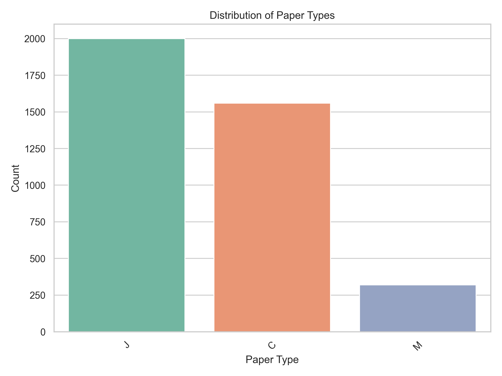
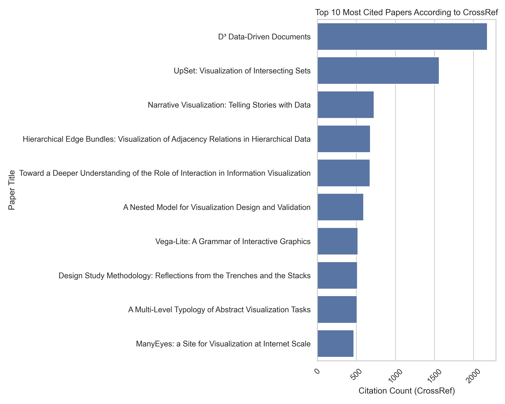
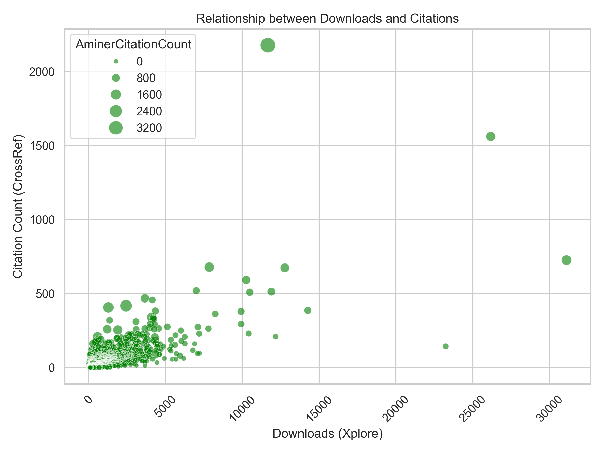

# Data Visualization Report

## Introduction
In the dynamic realm of academic publications, understanding the ebb and flow of research output is crucial for grasping the evolving landscape of knowledge dissemination. We begin with an exploration of **Yearly Trends in Conference Publications**, offering a lens into the shifting popularity and focus of conferences over time. This sets the stage for a deeper dive into the recognition of excellence, as we examine **Awarded Papers Over Time**, shedding light on the years marked by notable achievements. As we navigate further, the **Distribution of Paper Types** provides a snapshot of the diversity within the dataset, while the **Top Cited Papers** highlight the influential works that have shaped the field. Finally, we probe the intricate relationships between metrics with analyses of **Citation Count Correlation** and **Downloads vs. Citations**, uncovering potential consistencies or discrepancies in how academic impact is measured. Together, these themes weave a comprehensive narrative of the dataset's insights into academic publishing trends and impact.

## 1. Yearly Trends in Conference Publications

The chart above illustrates **Yearly Trends in Conference Publications**, highlighting the evolving landscape of academic interest and focus across different conferences. Notably, the Vis conference exhibits a significant upward trend from 2010 to 2025, with publications increasing by approximately 100, reflecting a growing interest or expansion in its field. This consistent rise, depicted by the blue line, suggests that stakeholders should prepare for continued growth by expanding resources and capacity. In contrast, the SciVis conference has experienced a general decline in publications since 2010, with a notable dip around 2015, as shown by the red line. This trend may indicate a shift in research focus or increased competition, prompting SciVis organizers to explore new topics or collaborations to rejuvenate interest. Throughout the observed period, the Vis conference consistently leads in publication numbers, underscoring its strong and possibly expanding community. Other conferences might consider strategic partnerships or thematic expansions to leverage Vis's popularity and enhance their own visibility.
Extending this view of conference dynamics, we now explore the **Awarded Papers Over Time** to gain insights into trends in award recognition. Since the Vis conference has shown a robust increase in publications, it is pertinent to examine whether this growth correlates with a rise in awarded papers, potentially highlighting years of significant achievements and innovation. This analysis will help us understand if the upward trend in publications is mirrored by an increase in recognition, thereby offering a deeper perspective on the impact and quality of research within these conferences.

## 2. Awarded Papers Over Time

The chart above illustrates the **Awarded Papers Over Time**, highlighting significant trends in award recognition. Between 2005 and 2010, there was a noticeable increase in awarded papers, peaking at around 15 in 2010, suggesting a shift in the field possibly due to enhanced submission quality or changes in awarding criteria. From 2019 onwards, a significant rise is observed, reaching a peak of around 20 papers, indicating a major shift likely driven by increased research output or policy changes. This trend suggests growing recognition of research efforts, potentially encouraging more submissions. The period from 2020 to 2025 shows stabilization at a high level, around 17.5 to 20 papers, indicating a new norm in the field, possibly due to sustained high-quality research or consistent awarding criteria, suggesting the field has reached a mature phase of recognition that could impact future research funding and focus.
Building on the observed trends in award recognition, we now delve into the **Distribution of Paper Types** to understand the landscape of publication formats that contribute to these achievements. Since the stabilization in awarded papers suggests a mature phase of recognition, examining the diversity and predominance of different paper types can reveal whether certain formats, such as journal or conference papers, are more likely to receive accolades. This analysis will provide a nuanced view of how publication types influence recognition and may inform future research strategies and publication decisions.

## 3. Distribution of Paper Types

The bar chart illustrating the **Distribution of Paper Types** reveals significant insights into the prevalence and diversity of publication types within the dataset. The 'J' paper type stands out with the highest count, exceeding 1900, indicating a substantial demand or production focus, which suggests that prioritizing 'J' type papers could optimize resources or marketing strategies. In contrast, the 'M' paper type, with a count under 500, represents a niche market or limited production capacity, prompting a need to evaluate its profitability to decide on future production strategies. Meanwhile, the 'C' paper type, with approximately 1500 papers, is about 25% less than the 'J' type, reflecting moderate demand or strategic focus. Analyzing market trends could reveal opportunities to increase the production of 'C' type papers to capture additional market share.
Zooming in on the impact of these publication types, we now examine the **Top Cited Papers** to identify the most influential works within the dataset. Since the 'J' paper type dominates in quantity, it is crucial to assess whether this prevalence translates into higher citation counts, thereby affirming their influence in the academic community. By analyzing the top 10 most cited papers, we can determine if the diversity in paper types correlates with citation impact, offering insights into which types not only proliferate but also resonate most with the scholarly audience.

## 4. Top Cited Papers

The bar chart above illustrates the **Top Cited Papers** according to CrossRef, highlighting the most influential works in the dataset. The paper "D³ Data-Driven Documents" stands out with over 2000 citations, significantly surpassing others and underscoring its foundational impact on data visualization. In contrast, "UpSet: Visualization of Intersecting Sets" follows as the second most cited, with around 1000 citations, reflecting its innovative approach to set visualization. Notably, there is a marked drop of approximately 400 citations from the second to the third most cited paper, indicating a substantial difference in perceived impact or applicability. This pattern is evident in the chart, where the top bar is notably longer than the others, emphasizing the prominence of these leading papers.
To test this pattern of citation prominence, we now explore the **Citation Count Correlation** between Aminer and CrossRef. Since the bar chart highlights significant disparities in citation counts among top papers, examining the correlation between these two sources can reveal whether such discrepancies are consistent across different citation metrics. This analysis will help us understand the reliability and alignment of citation data, providing a more comprehensive view of how these influential works are recognized across platforms.

## 5. Citation Count Correlation

The scatter plot above explores the **Citation Count Correlation** between Aminer and CrossRef, highlighting the consistency and discrepancies in citation metrics across these platforms. As Aminer citation counts increase, the confidence interval around the trend line widens, indicating greater uncertainty in CrossRef counts at higher Aminer levels. This suggests variability in how citations are recorded or reported, reflecting the challenges of maintaining consistent metrics across different sources. Notably, there is a noticeable spread in CrossRef citation counts for Aminer counts above 1000, which likely reflects increased variability in citation practices or data coverage at these higher levels. Additionally, an outlier with a very high CrossRef citation count relative to its Aminer count suggests a publication that is particularly influential in contexts captured by CrossRef but not as much by Aminer, possibly due to differences in database coverage or indexing practices. Understanding these patterns and outliers can help refine citation metrics and improve cross-database consistency, with further analysis needed to enhance the reliability of citation data for highly cited publications.
Stepping back from the intricacies of citation count discrepancies between Aminer and CrossRef, we now turn our attention to the relationship between downloads and citations. Since the variability in citation metrics highlights the challenges of consistent data interpretation, examining whether higher download numbers correlate with increased citation counts can provide further insights into the factors driving academic influence. This analysis will help us understand if the visibility and accessibility of publications, as indicated by download frequency, align with their scholarly impact as measured by citations.

## 6. Downloads vs. Citations

The scatter plot above illustrates the relationship between downloads and citation counts, revealing several key insights into academic publishing dynamics. Notably, a few outliers with exceptionally high download numbers exceeding 20,000 also exhibit citation counts over 1,000, highlighting the impact of highly influential papers that capture significant attention, consistent with the long-tail effect. This suggests a potential area for further analysis to identify replicable strategies for other papers. Additionally, the size of the bubbles, representing AminerCitationCount, generally increases with both downloads and CrossRef citation counts, indicating a positive correlation between these metrics. This trend suggests a reinforcing cycle where higher citations in one database enhance visibility and citations in others, advocating for a multi-platform citation strategy. Furthermore, among papers with fewer than 5,000 downloads, there is a noticeable clustering of citation counts below 500, reflecting a common phenomenon where lower download numbers correlate with lower citation counts. This pattern underscores the need to explore factors that could boost both downloads and citations, focusing on enhancing visibility and accessibility in the coming year.

## Conclusion
The analysis of academic publishing trends reveals several interconnected themes across the dataset. The **Yearly Trends in Conference Publications** indicate a significant rise in publications at the Vis conference, suggesting a growing interest in its field, while the SciVis conference faces a decline, potentially due to shifting research focuses or increased competition. This trend of growth in Vis is mirrored in the **Awarded Papers Over Time**, where a stabilization at high levels of awarded papers from 2020 to 2025 suggests a mature phase of recognition, possibly due to sustained high-quality research. The **Distribution of Paper Types** shows a dominance of 'J' type papers, which aligns with their prevalence in the dataset, yet the impact of these types is further highlighted in the **Top Cited Papers**, where the most cited works underscore their foundational influence. The **Citation Count Correlation** between Aminer and CrossRef reveals discrepancies, particularly at higher citation levels, suggesting challenges in maintaining consistent metrics across platforms. Finally, the **Downloads vs. Citations** analysis indicates a positive correlation between downloads and citations, with outliers suggesting that highly downloaded papers often achieve significant citation counts, reinforcing the importance of visibility and accessibility. These patterns suggest that strategic focus on enhancing visibility, fostering collaborations, and leveraging multi-platform citation strategies could optimize academic impact and recognition.
